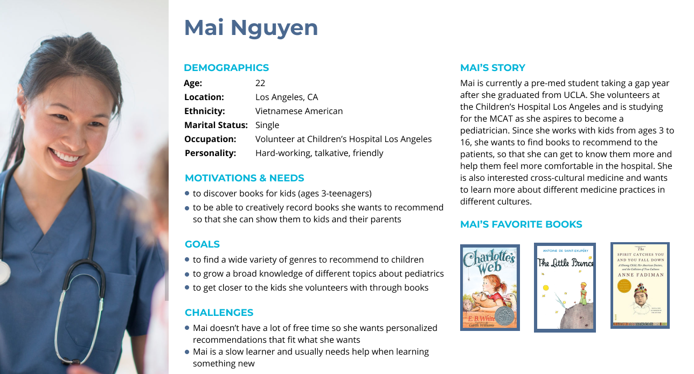

# Assignment 5

## 📖 The Purpose of UX Storytelling
* The purpose of UX storytelling is to shift your perspective to the user's perspective and see the world how they would see it.
* Creating personas and their story lets you and your team share the same image of the users.
* Storytelling also helps filter out any biases you or your interviewees had and focus solely on the users.

## 👤 Persona & Empathy Map

### Persona 1: Mai Nguyen - aspiring pediatrician and creative reader

#### Mai Nguyen's Empathy Map

## Scenarios & Journey Map
