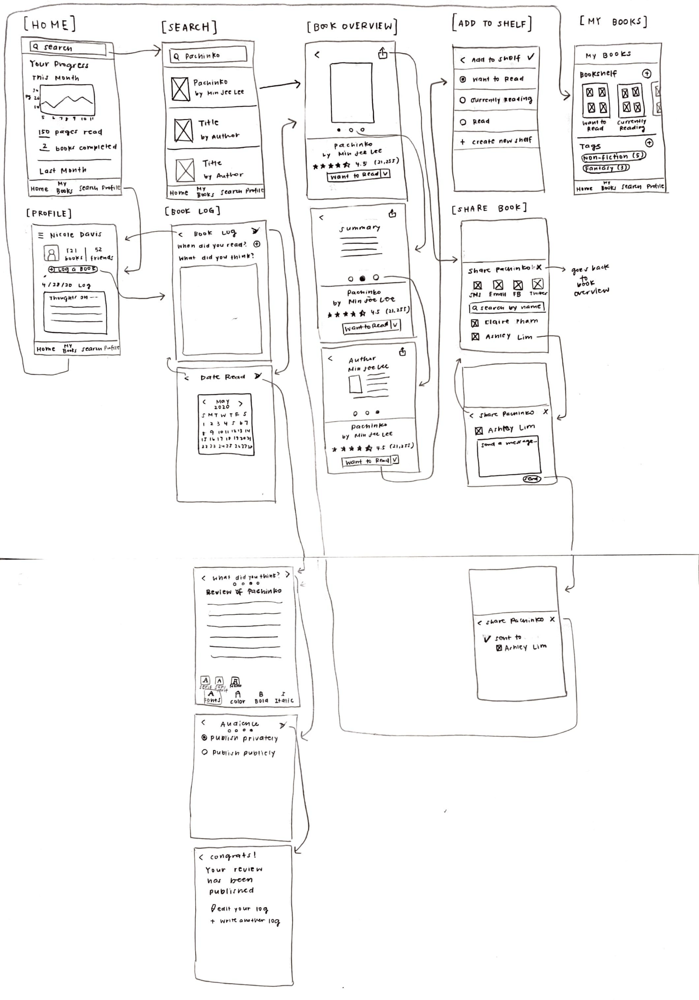
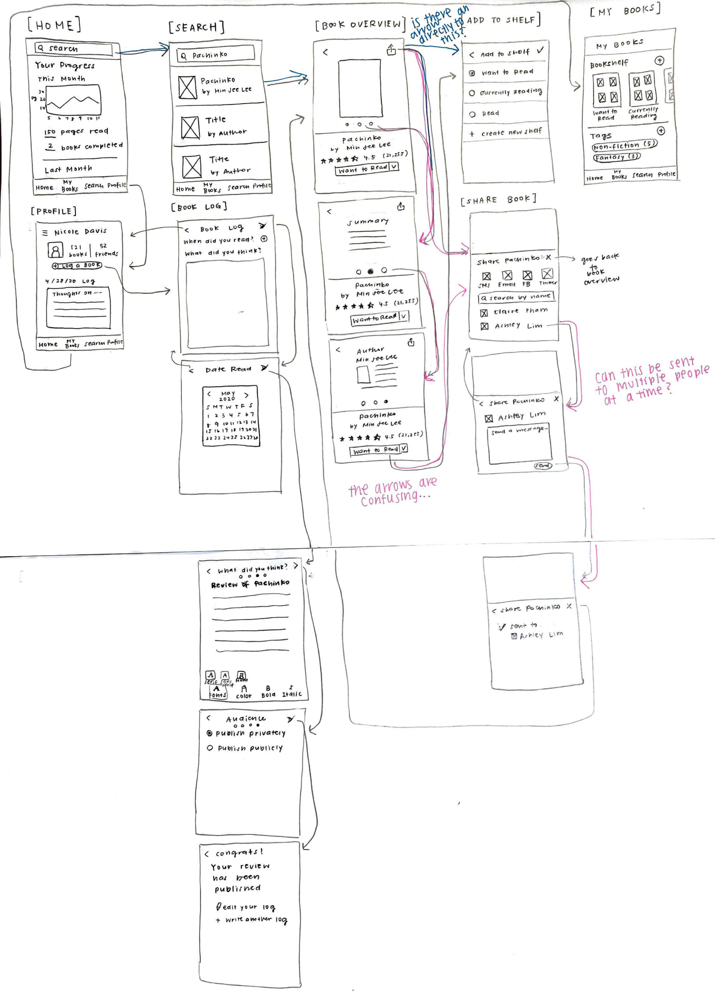
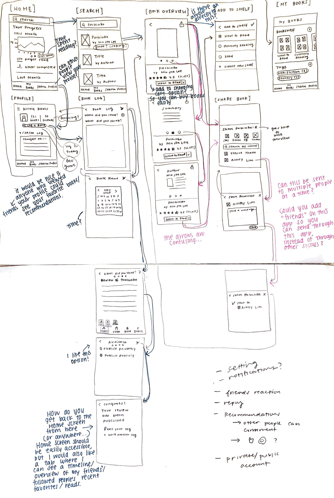

# Assignment 6

## 📝 Description of Project
* I want to create an app that allows people to find, share, and track books they have read, 
based on the social book cataloging site/app Goodreads. My ultimate goal is to make reading books more fun 
through creating a community of readers. 
* What I have researched so far:

  * Based on my heuristics evaluation, I found that the Goodreads website had issues in error prevention and minimalist design.
There were too many buttons and links, making the website feel cluttered. Error prevention was also an issue; 
I could not complete a task because my email was not verified. 
I want to keep these issues from the website in mind when creating a low-fidelity prototype for the app.

  * In my usability testing, I found that minimal design was also an issue, 
because the user had a hard time finding a link because there were too many buttons and links on the website.

  * In my user research and contextual interview, I found that book logs function as not just a place to record books, 
but also a creative outlet. Another motivation for keeping track of books was to share and recommend it with other people. 

* 3 Personas

  From the above findings, I created three personas: 
  * Mai, an aspiring pediatrician who wants to creatively log books to show to her patients
  * Nicole, an organized and social reader who wants to share books with her friends
  * David, who wants a simple app to find and share books with his grandchildren. 
  
  (please see [here](https://github.com/yoshinogoto/DH150-YoshinoGoto/blob/master/Assignment05.md) 
  to meet these 3 cool people!)
  
* 3 Features

  Based on the personas, I came up with 3 features they could find useful:
  * Simple flow and showing where they are in a particular process for people like David. 
  I tried to keep each screen as simple as possible and let users know where they are in a certain process, 
  like logging a book or looking at an overview of the book. 
  * A share button for a user like Nicole, where she can share any book through SMS, email, Facebook, 
  and other social media websites, or directly through friends she connects with on the app and send a message.
  * A book log button where a user like Mai can log books in a creative way. 
  She can change the font, change colors, and bold/italicize selected parts.

* Purpose of Low-fidelity Prototype
  * See whether the features I came up with work for a user. 
  I want to see if the user can navigate through the features and flow I created.
  * Detect any major problems with the features, as well as any additional features the user wants to see.
  * Objectively see what I have made so far by looking at how a user interacts with it.

## 3️⃣ Tasks This Prototype Will Support
1. Search *Pachinko* by title from home screen and add it to “want to read” shelf
2. Look at the overview of *Pachinko* and share it to Ashley, your friend who also uses the app
3. Write a book log and publish it to the public

## Prototype

## Prototype Testing
1. During Task 1: Search *Pachinko* by title from home screen and add it to “want to read” shelf

2. During Task 2: Look at the overview of *Pachinko* and share it to Ashley, your friend who also uses the app

3. During Task 3: Write a book log and publish it to the public
(includes some notes I took after I asked the participant if she had anything else she wanted to add)

