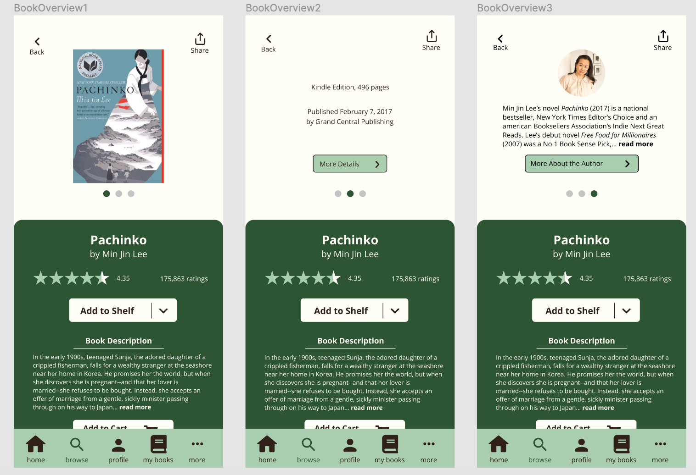
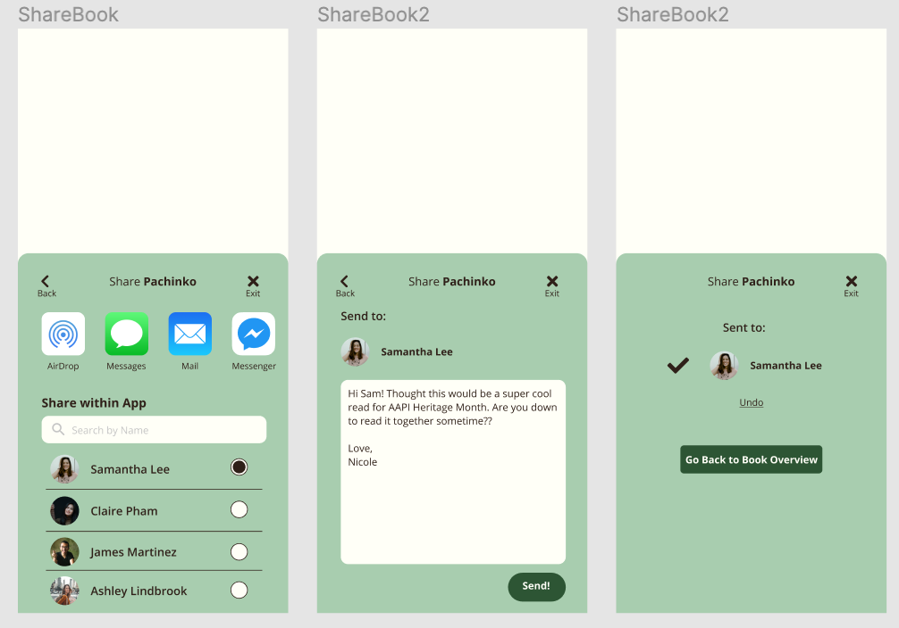
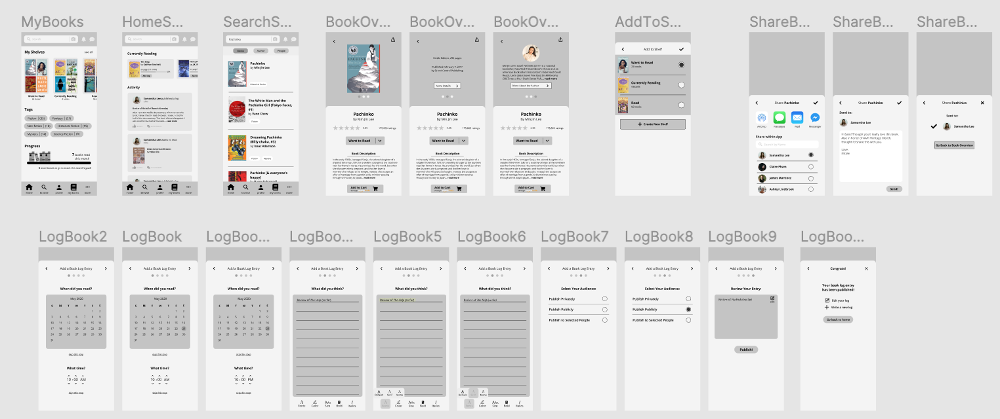
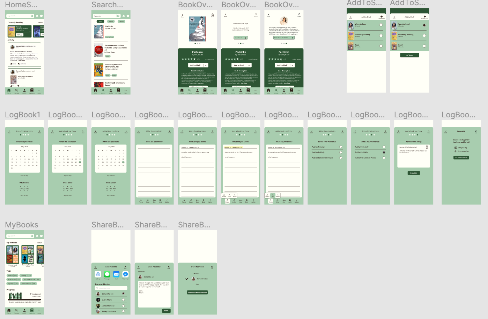
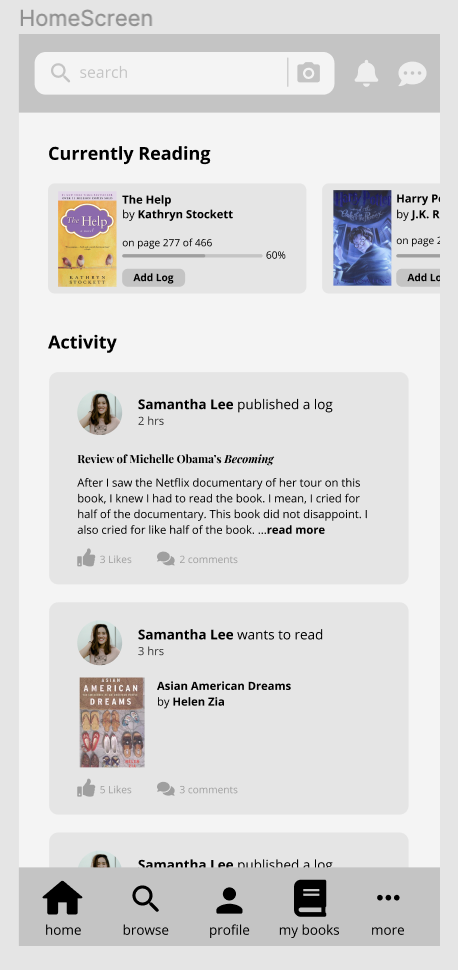
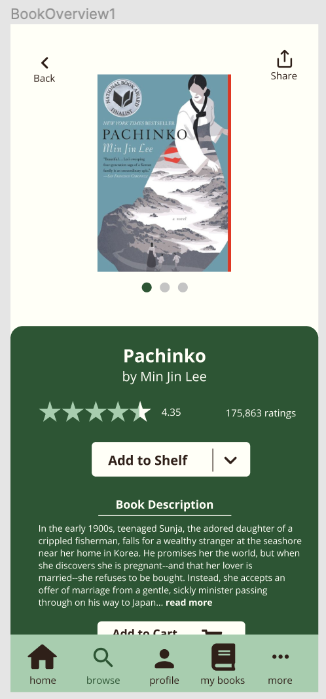

# Assignment 7: High Fidelity Prototype

## 📝 Description of Project
* This is a high-fidelity prototype of a social media app for book readers, essentially like Goodreads, 
with some added features. My process of creating this prototype was: 
(1) referring to the [low-fidelity prototype](https://github.com/yoshinogoto/DH150-YoshinoGoto/edit/master/Assignment06.md)
and [my personas](https://github.com/yoshinogoto/DH150-YoshinoGoto/blob/master/Assignment05.md) to create the three features on Figma, 
(2) a cognitive walkthrough and impression test with three of my classmates, 
(3) 4 usability tests with my classmates, 
(4) revision. 
The purpose of this prototype is to create and test the three features designed based on my three personas: 
Mai, Nicole, and David, and to see if it is usable for actual users. 

## 🗒 A List of Tasks this Prototype Supported
1. For bookworm grandpa David: easily be able to search a book, then immediately look at the summary, 
book information, author information, purchase the book, and add it to his bookshelf.
2. For organized, social reader Nicole: sharing a book to friends through other social media apps 
such as texting and email but also within the app.
3. For the creative reader Mai: a way to keep a book log on a book you are currently reading and be able to change fonts 
and colors of your log.

## 👩‍🎨 Graphical Interface Design Decisions
* For my final revision of the prototype, I picked green as my main colors because I thought they would be easier on the eyes of book readers. I wanted to give the whole app a relaxing and clean feel, reminiscent of a library. 
* I applied the Gestalt principles such as proximity, symmetry, and similarity to distinguish a group of buttons from others. For example, in the book overview screens below, the circles that allow the users to navigate between the book cover, book information, and author information, are close together and similar to show that they are grouped together.
* I made most buttons as rectangles with rounded edges. They are all the same shape to make it consistent and easy for the user to notice that they are pressable buttons.

## 📱 Examples of Screen Designs
* Home Screen 

* Book Overview Screens

* Sharing Screens

## 🔀 Wireflow
Here's my wireflow for all of the screens:

## 🤏 Interactive Prototype
[Link to Prototype](https://www.figma.com/proto/vQgROUikqRg7ot0jH1p4jb/DH-150-Assignment-7?node-id=1%3A2&scaling=min-zoom)

## 🗣 Impression Test 
* Some quotes from my peers during class:
> "I really like how you show the number of books read in the 'My Books' page, it's really cute."

> "Feels very familiar and straightforward"

> "Bottom bar is consistently there"

> "Feels professional"

## 🎨 Accessibility (Color Contrast) Check
* I picked dark green and light green for a relaxing feel and made the backgrounds an ivory color to make it less harsh on the eyes. The contrasts between the text and the background all passed the WCAG 2.0 AA & AAA levels.
  

## 🏃‍♀️ Cognitive Walkthrough
* The main feedback received from my peers were about some inconsistencies in the app, such as the search bar being at the top and another search button being at the bottom. They suggested I could delete, or possibly change it to a browse button that leads to personalized recommendations and popular books.
* Some people also mentioned that the font seemed small, especially on the home screen.  

## ✔️ Usability Tests
* I conducted four usability tests among my classmates. This is the link to my [Questionnaire](https://docs.google.com/forms/d/1gFEl9FnyQJAbu2WAQkpiq2jUFWfagpK3CQgNGD3jSMU/prefill).
* *Method*: These usability tests were conducted over Zoom and with the permission of the participants, their screen and facial expressions were recorded.
* Video Recordings:
  * Video of [UT1](https://drive.google.com/file/d/1FhlIH2O9TZDEg9OsSmlAD7knr9kJeVWe/view?usp=sharing)
  * Video of [UT2](https://drive.google.com/file/d/1TDBBgD78J7QM5HQkRdHwygFiLplGLETn/view?usp=sharing)
  * Video of [UT3](https://drive.google.com/file/d/1hfoTMkME-wB9syVodxF7pu0eqnIUvO4k/view?usp=sharing)
  * Video of [UT4](https://drive.google.com/file/d/1GziBQe9RMd09TPUcc3SRZ_ZAXmnBUHoT/view?usp=sharing)
* *Main Findings*:
  * All participants were able to complete the three tasks.
  * Home screen fonts were too small.
  * Some participants had a hard time getting to the "done" button after adding a book to their "want to read" bookshelf.
  * Some participants had a hard time finding the "share" button.
  * The "write a book log" was the function least likely to be used by these participants.
  * Adjectives used the most frequently to describe this app were: creative, familiar, and trustworthy.

## 🖍 Main Revisions
* Change the colors of the app from gray to green, because I felt like gray was too cold and professional. Some participants noted that the app felt very professional, but I wanted to go for a more friendly, casual look because this is a social media app. 

  

* Made the fonts larger for the home screen. I also changed the "search" in the bottom to be "browse." 
 

* Moved the “create new shelf” button at the top and moved the “done” button below the existing bookshelves. During the usability tests, I noticed that most people’s mouses travel downward, so the most natural thing would be to put the “done” button below everything so that once a user finishes an action, s/he will just have to travel down to finish the interaction. 

 

* Put labels for my icons. Also made the "add to cart" button visible in my prototype. This made me wonder...How effective are icons if I need labels for most of them? I am sure many easily recognizable ones, such as search icons or home icons, are very helpful. However, seeing users not be able to recognize the share icon was interesting because I felt like it was a pretty conventional icon. So, I wonder how effective icons are in helping users recognize buttons.
 

## 💭 Reflection
* Summary: Overall, I think I was able to reach my goal of making an app that meets the needs of my three personas. I was able to make revisions after my usability tests, and I was able to experience the process of iterative design first-hand.
* What Went Smoothly: I was able to implement the features smoothly on Figma. As expected, this whole process took me a long time, from creating the first high-fidelity prototype to testing it and revising it. Doing the usability tests over Zoom also went a lot more smoothly than I thought. I was able to clearly see where the participant was moving, their facial expressions, and their thoughts, almost like being there next to them. 
* What Didn't Go as Expected: I thought the "book log" feature would be cool, since during my contextual interview, the interviewee mentioned that she would want a feature to be able to record her thoughts about books she was reading and use it as a creative outlet. However, the participants in my usability tests thought that they would be least likely to use the book log feature out of the three features I tested.
* What I Would Change: First, I would do more field research and interviews to make sure the product I am making is actually reflective of a larger population. Although I made my revisions after all of the tests were conducted, I think I would also have made changes to the design after each usability test. This would let me test through more designs and keep improving it after each test. While UX design is, of course, a user-centered process, I wonder what it is like to have to balance the business needs and user needs. For example, I had an "add to cart" button so that users can purchase books in the app. If I had to work with businesses, I would imagine that the method of purchase would be narrowed down to one method--for example, the "add to cart" button could lead to the Amazon Kindle page for that book instead of multiple vendors of the book.
