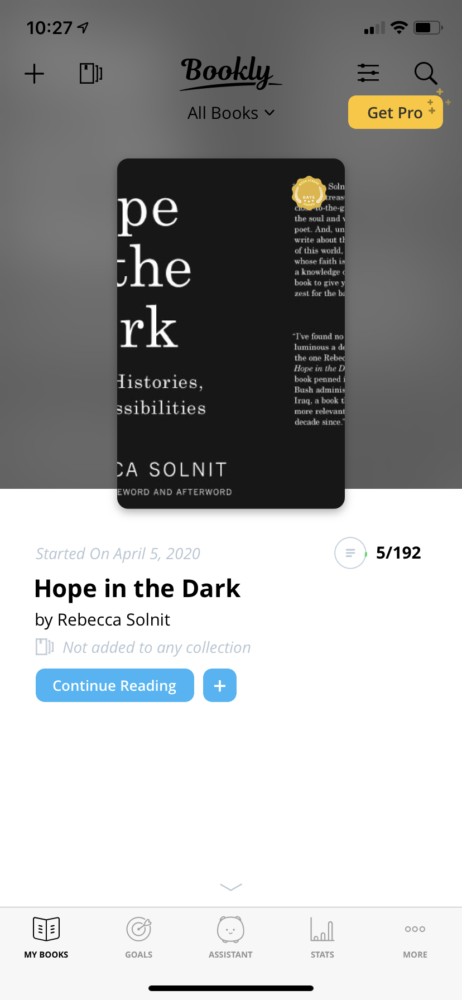

# Reading Tracker App
Yoshino Goto\
Digital Humanities 150\
My project of interest is a reading tracker app that allows readers to track books they have read.

## Website #1: Goodreads

https://www.goodreads.com/
### About Goodreads
Goodreads is a website where book readers can track books they have read, want to read, read book reviews, and share books with friends and people around the world.

### Overall Evaluation of the Website
Overall, the website is relatively user-friendly and does its job as a place to track books users have read and want to read. However, the main issues with this website lie in error prevention and minimalist design. While it does provide good documentation for solving many of the problems users encounter, it should create a design that prevents many of these errors such as email addresses not being verified. In addition, the aesthetics of the website feel very cluttered and difficult to use, which could deter users away from using Goodreads. 

### Heuristics Evaluation
1. **Visibility of system status**
* When adding a new book, instructions are unclear and does not show clear steps to the end goal. Although it marks which fields are required, it is difficult for the user to know how to fill out each piece of information about the book. The website recommends searching for books first, however, so most users would not use this function often, and thus severity rating is medium. (2)
2. **Match between system and real world**
* The website has no visible issues with this. It uses words that match real-world conventions like "bookshelf" and "group discussions" to refer to the user's list of books and discussion forums.
3. **User control and freedom**
* The website should add an easily accessible undo or edit button whenever a user posts a book review, since they could notice some mistakes after they have posted. However, this is a minor problem because the user could just go back to the review he/she wrote and edit it back. (1)
4. **Consistency and standards**
* There a lot of different words used that are hard to distinguish from each other. For example, it is hard to differentiate between the term "bookshelf," which refers to your list of books you want to read or are currently reading, and "list," which refers to a list of recommendations from other people. (2)
* It is good that the website uses conventions like highlighting a word or underlining a word when a user hovers over a clickable link, but it could be standardized to just one convention for consistency. (1)
5. **Error prevention**
* I could not manually add a book because my email address was not verified. This could be a critical problem, because it could be a major obstacle that deters users away from using the website. It should either give a link to resend an email verification, text a code to the user's mobile device, or let the user know right away after getting started to verify their email to prevent future errors. (3)
6. **Recognition rather than recall**
* The website does a good job with this. For example, when searching for a book, the website generates possible books with the word the user typed so far, so that the user can just recognize the book they are looking for.
7. **Flexibility and efficiency of use**
* Although there are many, many functions you can perform in this website, there aren’t any shortcuts and even if there are any, they are very hard to discover or not documented anywhere, making it hard for any user, novice or experienced, to find them. However, shortcuts are not critical or necessary for users to use the website, so this is a problem with medium severity. (2)
8. **Aesthetic and minimalist design**
* Different fonts (serif and sans serif) are used throughout the website, and some are italicized or bolded for no apparent reason, making the website look more complicated than it is. In addition, the words are too small and don't make use of the entire screen space, causing the website to feel cluttered. These altogether make the website seem harder to use and deter users away, so I categorized it as critical. (3)
* There are unnecessary buttons, such as two search bars in one screen that search for the same thing. While it does not affect any functions the user wants to perform, it does make the website confusing. (1)
9. **Help users recognize, diagnose, and recover from errors**
* There weren't any major issues with this. For common errors such as when I can't find a book, the website indicates the problem and suggests a solution, such as giving me a link to register a new book.
10. **Help and documentation**
* The website does a good job with its documentation. For example, when they could not generate any book recommendations for the user, they (1)tell him/her why (because the user did not rate enough books) and (2)gives a link to where the user can rate more books.
 

## App #2: Bookly

https://getbookly.com/
### About Goodreads
Bookly is an app where users can track books they have read or are planning to read. It also allows users to track the amount of time they have read so that they can make reading a habit more easily.

### Overall Evaluation of the Website

### Heuristics Evaluation
1. **Visibility of system status**
* 
2. **Match between system and real world**
* 
3. **User control and freedom**
* 
4. **Consistency and standards**
* 
5. **Error prevention**
* 
6. **Recognition rather than recall**
* 
7. **Flexibility and efficiency of use**
* 
8. **Aesthetic and minimalist design**
* 
9. **Help users recognize, diagnose, and recover from errors**
* 
10. **Help and documentation**
* 
